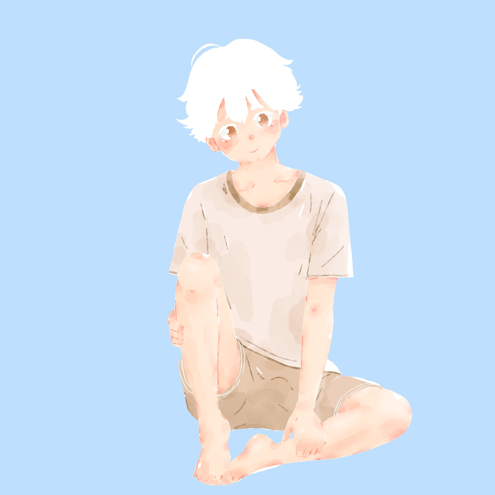
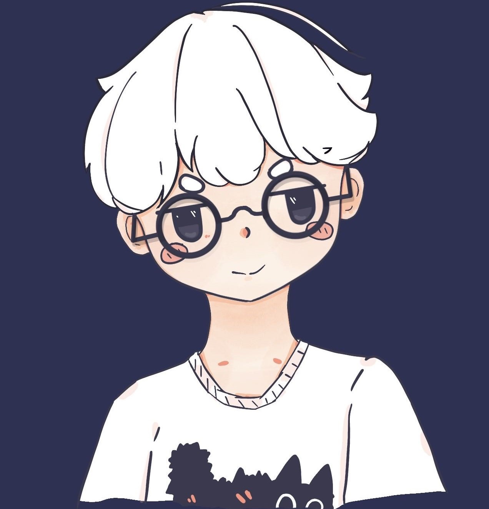

## About Me

- ⭐ 一个心理学专业的大学生 / A college student majoring in Psychology
- 🫡 一个社会自由主义者 / A social liberal
- 📖 喜欢漫画, 动漫, BJD / Likes manga, anime and BJD
- 🖌️ 喜欢画画 / Likes watercolor and painting
- 😋 喜欢吃草莓, 鱿鱼, 抹茶 / Likes eating strawberries, squid and matcha
- 🧠 喜欢编程 / Interested in technology and programming
- 🖥️ 主要用 JS, TS, Go, Rust / Mainly uses JavaScript and TypeScript, currently learning Go and Rust
- 🥰 喜欢任何可爱的人事物 / Likes cute things and people
- 😊 致力于称为一个有帮助的心理咨询师 / Committed to becoming an excellent psychological counselor
- 📖 我的[博客](https://blog.leafyee.xyz) / I'm writing my [blog](https://blog.leafyee.xyz).
- ✉️ 我的[邮箱](mailto://xiaoyezi@leafyee.xyz) / Reach me at my [mail](mailto://xiaoyezi@leafyee.xyz).

## GitHub Stats

|||
|:---:|:---:|

## Some Pictures

<table>
  <tr>
    <td></td>
    <td></td>
    <td></td>
  </tr>
  <tr>
    <td></td>
    <td></td>
    <td></td>
  </tr>
</table>

## Langs & Tools
<table class="skills">
  <tr>
    <td>HTML5</td>
    <td>CSS3</td>
    <td>JavaScript</td>
    <td>Node.js</td>
    <td>React</td>
    <td>Solid</td>
    <td>Wails</td>
  </tr>
  <tr>
    <td></td>
    <td></td>
    <td></td>
    <td></td>
    <td></td>
    <td></td>
    <td></td>
  </tr>
  <tr>
    <td>Deno</td>
    <td>Express.js</td>
    <td>Hono.js</td>
    <td>Next.js (Learning)</td>
    <td>Rust (Learning)</td>
    <td>Python (Learning)</td>
    <td>GoLang</td>
  </tr>
  <tr>
    <td></td>
    <td></td>
    <td></td>
    <td></td>
    <td></td>
    <td></td>
    <td></td>
  </tr>
  <tr>
    <td>Vite.js</td>
    <td>Bun</td>
    <td>Cloudflare Pages</td>
    <td>Cloudflare Workers</td>
    <td>Ant Design</td>
    <td>Vercel</td>
    <td>Puppeteer</td>
  </tr>
  <tr>
    <td></td>
    <td></td>
    <td></td>
    <td></td>
    <td></td>
    <td></td>
    <td></td>
  </tr>
  <tr>
    <td>NPM</td>
    <td>PNPM</td>
    <td>GitHub</td>
    <td>Tauri (Learning)</td>
    <td>Markdown</td>
    <td>MongoDB</td>
    <td>Playwright</td>
  </tr>
  <tr>
    <td></td>
    <td></td>
    <td></td>
    <td></td>
    <td></td>
    <td></td>
    <td></td>
  </tr>
  <tr>
    <td>Cloudflare</td>
    <td>Docusaurus</td>
    <td>Hexo</td>
    <td>TypeScript</td>
    <td>Linux (Learning)</td>
    <td>Git</td>
    <td>Tailwind CSS</td>
  </tr>
  <tr>
    <td></td>
    <td></td>
    <td></td>
    <td></td>
    <td></td>
    <td></td>
    <td></td>
  </tr>
</table>
