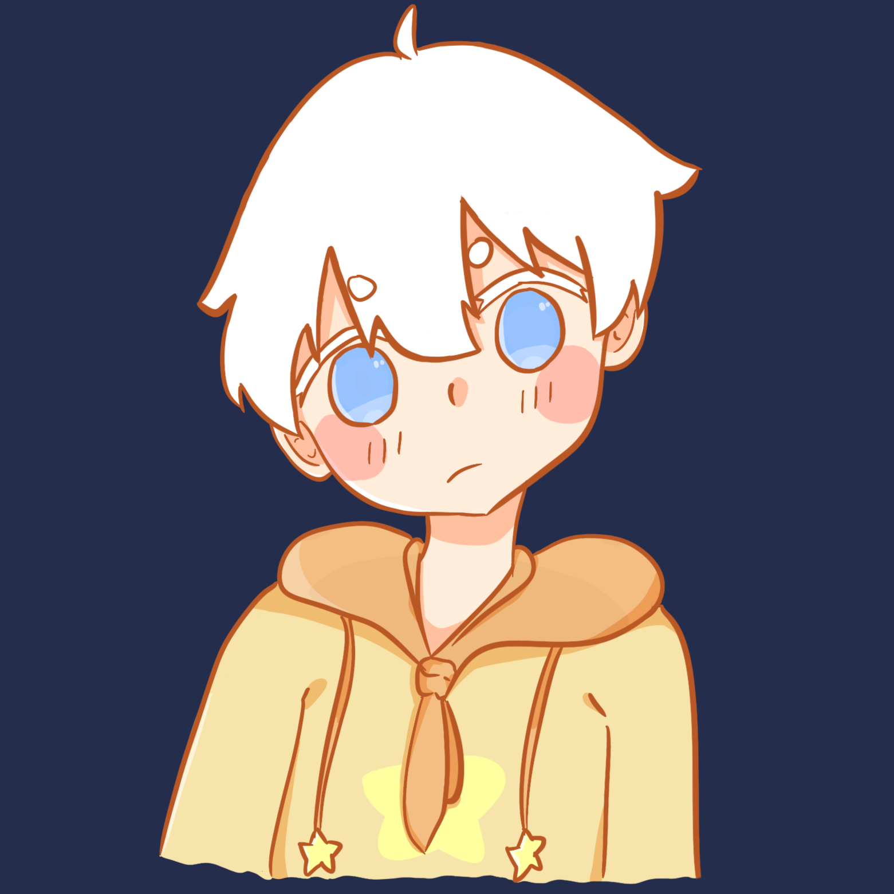
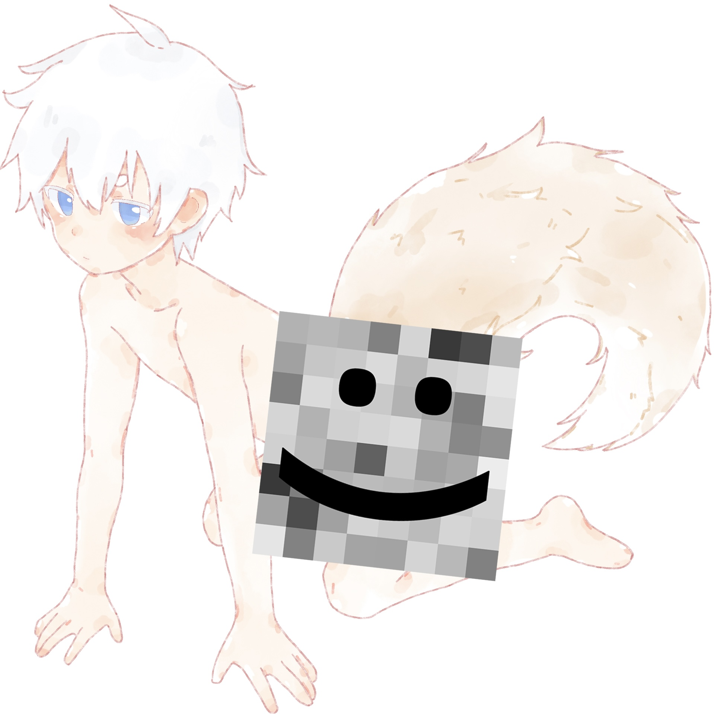

## About Me

- I am an undergraduate student majoring in psychology at Beijing Normal University
- He/Him, LGBT🌈
- I'm passionate about programming and work as a full-stack developer. I use `TypeScript` and `Go` on a daily basis. I'm also familiar with `JavaScript` and `Python`, and am currently struggling to learn `Rust`. You can find more on [my Github](https://github.com/LeafYeeXYZ).
- My life motto is **Unity of Knowledge and Action**.
- I love reading manga. My favorite art styles are from the Japanese manga artist Kii Kanna and the Chinese manga artist Liang A Zha!
- I enjoy drawing. You can check out my works in [my gallery](https://blog.leafyee.xyz/masonry).
- I collect BJD (Ball-Jointed Dolls). You can also see my dolls in [my gallery](https://blog.leafyee.xyz/masonry).
- I enjoy spontaneous trips without over-planning. I dislike crowded places and strongly reject the idea of "military-style tourism."
- I like traditional Chinese-style and electronic music. Some of my favorite musicians or projects are *Wangchuan Fenghua Lu*, *ChiliChill*, *Xiao Ye Dao*, among others.
- Though I'm neither socially anxious nor shy, I'm an introverted person who dislikes attending large social events.
- My dream is to become an excellent psychotherapist and help more people!
- My favorite foods include: *strawberries*, *matcha*, *squid*, *boneless chicken feet*, and *snowflake crisp*.
- Foods I dislike: *fennel* (scarred by the terrible fennel dumplings at school).
- I'm a light Hanfu enthusiast but prefer "Han elements" clothing that can be worn daily.
- Politically, I lean towards *social liberalism* and aspire to make the world a better place~

### 中文

- 就读于北京师范大学心理学部
- 性别男(生理+心理性别), 性取向男
- 喜欢看漫画, 画风最喜欢的日本漫画家是 `Kii Kanna`、中国漫画家是 `梁啊渣`!
- 喜欢画画, 可以在[我的相册](https://blog.leafyee.xyz/masonry)里看到我的作品~
- 玩BJD, 可以在[我的相册](https://blog.leafyee.xyz/masonry)里看到我的娃们~
- 喜欢说走就走的旅行, 不喜欢过度计划的行程, 讨厌人太多的地方, 同时坚决拒绝"特种兵式旅行"
- 喜欢国风/电子音乐, 最喜欢的音乐人/音乐企划有 `忘川风华录`、`ChiliChill`、`小野道ono` 等
- 爱好编程, 从事全栈开发, 日常使用 `TypeScript` 和 `Go` 语言, 会用 `JavaScript` 和 `Python`, 正在艰难学习 `Rust`, 详见[我的Github](https://github.com/LeafYeeXYZ)
- 人生信条是**知行合一**
- 虽然不社恐也不怕生, 但是一个内向的人, 不喜欢去一些很多人的社交活动
- 梦想是成为一个优秀的心理咨询师, 帮到更多的人!
- 喜欢吃的东西有: `草莓`、`抹茶`、`鱿鱼`、`无骨鸡爪`、`雪花酥`
- 不喜欢吃的东西有: `茴香` (被学校的茴香饺子难吃到了)
- 轻度的汉服爱好者, 但是更喜欢那种可以日常穿的"汉元素"服装
- 政治观点上偏向 `社会自由主义`，希望让这个世界更美好~

## Skills & Projects

### Languages
<table>
  <tr>
    <td>JavaScript</td>
    <td>TypeScript</td>
    <td>Go</td>
    <td>Rust (Learning)</td>
    <td>Python (Learning)</td>
    <td>HTML5</td>
    <td>CSS3</td>
    <td>Markdown</td>
  </tr>
  <tr>
    <td></td>
    <td></td>
    <td></td>
    <td></td>
    <td></td>
    <td></td>
    <td></td>
    <td></td>
  </tr>
</table>

### Frontend
<table>
  <tr>
    <td>React</td>
    <td>Solid</td>
    <td>Ant Design</td>
    <td>Tailwind CSS</td>
    <td>Astro</td>
  </tr>
  <tr>
    <td></td>
    <td></td>
    <td></td>
    <td></td>
    <td></td>
  </tr>
</table>

### Backend & Fullstack
<table>
  <tr>
    <td>Node.js</td>
    <td>Deno</td>
    <td>Bun</td>
    <td>Express.js</td>
    <td>Hono.js</td>
    <td>Next.js</td>
  </tr>
  <tr>
    <td></td>
    <td></td>
    <td></td>
    <td></td>
    <td></td>
    <td></td>
  </tr>
</table>

### Desktop & Mobile
<table>
  <tr>
    <td>Electron</td>
    <td>Wails</td>
    <td>Tauri</td>
  </tr>
  <tr>
    <td></td>
    <td></td>
    <td></td>
  </tr>
</table>

### Serverless
<table>
  <tr>
    <td>Cloudflare Workers</td>
    <td>Cloudflare Pages</td>
    <td>Vercel</td>
  </tr>
  <tr>
    <td></td>
    <td></td>
    <td></td>
  </tr>
</table> 

### Database
<table>
  <tr>
    <td>MongoDB</td>
    <td>PostgreSQL</td>
    <td>Supabase</td>
  </tr>
  <tr>
    <td></td>
    <td></td>
    <td></td>
  </tr>
</table>

### Automation & Testing
<table>
  <tr>
    <td>Puppeteer</td>
    <td>Playwright</td>
  </tr>
  <tr>
    <td></td>
    <td></td>
  </tr>
</table>

### Other Tools
<table>
  <tr>
    <td>Git</td>
    <td>GitHub</td>
    <td>NPM</td>
    <td>Vite.js</td>
    <td>Hexo</td>
    <td>Docker</td>
  </tr>
  <tr>
    <td></td>
    <td></td>
    <td></td>
    <td></td>
    <td></td>
    <td></td>
  </tr>
</table>

## Some of My Works

<table>
  <tr>
    <td></td>
    <td></td>
    <td></td>
  </tr>
  <tr>
    <td></td>
    <td></td>
    <td></td>
  </tr>
</table>

## GitHub Stats

|||
|:---:|:---:|

## Sponsor Me

|微信 `WeChat Pay`|支付宝 `Alipay`|PayPal|
|:---:|:---:|:---:|
|||[https://www.paypal.com/paypalme/OliverXYZ](https://www.paypal.com/paypalme/OliverXYZ)|